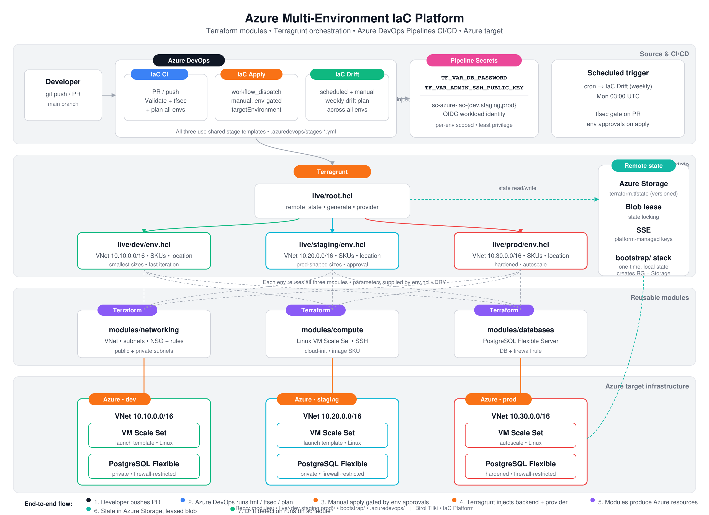

# Multi-Environment Azure Infrastructure as Code: Terraform, Terragrunt, and Azure DevOps

*Platform engineering for dev, staging, and prod on Azure — with a sibling repository on AWS.*

---

## Introduction

Teams outgrow a single Terraform root module when they need **isolated environments**, **shared modules**, **remote state**, and **gated delivery**. This platform implements that pattern on Azure: three environments in one repository, Terragrunt orchestration, Azure Blob remote state, and Azure DevOps pipelines for validate, scan, plan, apply, and drift detection.

The repository delivers **platform infrastructure** on Azure — networking, compute, and PostgreSQL. It is a **reference platform, not production-ready**: SSH, PostgreSQL, and state storage still use lab-oriented network defaults. The AWS equivalent is [aws-multi-env-iac](https://github.com/btilki/aws-multi-env-iac).

---

## Platform architecture

Change flows through the system as follows:

1. A pull request or merge to `main` triggers **IaC CI**.
2. Pipelines run format checks, bootstrap validation, **tfsec**, and **plan** for dev, staging, and prod.
3. **IaC Apply** (manual) deploys one environment at a time with Azure DevOps **environment approvals** on staging and prod.
4. **Terragrunt** injects backend and provider configuration; **Terraform modules** provision Azure resources.
5. **State** is stored in **Azure Blob Storage** with backend locking; **IaC Drift** runs on a weekly schedule.



*Figure 1 — Source control, Azure DevOps, Terragrunt, modules, Azure resources, and remote state.*

Design details: `docs/architecture/design.md` · Operator runbook: `docs/onboarding/runbook.md`

---

## Terragrunt layout

| Path | Role |
|------|------|
| `bootstrap/` | One-time remote state storage (resource group, storage account, container) |
| `live/root.hcl` | Shared `azurerm` backend and generated provider |
| `live/<env>/env.hcl` | Per-environment CIDRs, VM/DB SKUs, SSH CIDR, tags |
| `live/<env>/<stack>/terragrunt.hcl` | Module source and dependencies |

Example (`live/dev/networking/terragrunt.hcl`):

```hcl
include "root" {
  path = find_in_parent_folders("root.hcl")
}

locals {
  env = read_terragrunt_config(find_in_parent_folders("env.hcl"))
}

terraform {
  source = "../../../modules/networking"
}

inputs = {
  name_prefix          = local.env.locals.name_prefix
  location             = local.env.locals.location
  vnet_cidr            = local.env.locals.vnet_cidr
  public_subnet_cidrs  = local.env.locals.public_subnet_cidrs
  private_subnet_cidrs = local.env.locals.private_subnet_cidrs
  tags                 = local.env.locals.tags
}
```

Compute and database stacks declare a `dependency` on networking and use mock outputs during CI plan jobs (`TG_SKIP_DEP_OUTPUTS`).

---

## Bootstrap and remote state

Bootstrap provisions:

- State resource group
- Storage account (TLS 1.2, blob versioning)
- Private blob container

Terragrunt uses one state key per stack under `live/` (for example `dev/networking/terraform.tfstate`). Keep `live/root.hcl` aligned with bootstrap outputs. See `docs/architecture/state-strategy.md`.

---

## Azure DevOps pipelines

| Pipeline | Trigger | Purpose |
|----------|---------|---------|
| `azure-pipelines.yml` | PR and push to `main` | Validate, tfsec, plan all environments |
| `azure-pipelines-apply.yml` | Manual | Apply selected environment |
| `azure-pipelines-drift.yml` | Weekly and manual | Drift plan with `-detailed-exitcode` |

Service connections (per environment): `sc-azure-iac-dev`, `sc-azure-iac-staging`, `sc-azure-iac-prod`.

Secret variables: `TF_VAR_DB_PASSWORD`, `TF_VAR_ADMIN_SSH_PUBLIC_KEY` (mapped in `.azuredevops/terragrunt-job.yml`).

Promotion model: `docs/architecture/environment-promotion.md`

---

## Modules

- **networking** — VNet, subnets, resource group
- **compute** — NSG, Linux VMSS, SSH key authentication
- **databases** — PostgreSQL Flexible Server, database, firewall rules

Environment sizing is controlled in `live/*/env.hcl` (for example dev `10.10.0.0/16`, staging `10.20.0.0/16`, prod `10.30.0.0/16`).

---

## Security baseline

| Control | Implementation |
|---------|-----------------|
| No secrets in Git | ADO secret variables; no credentials in `*.tfvars` committed to Git |
| Least privilege | Separate service connection per environment |
| IaC scanning | tfsec on all pipeline entry points |
| Gated apply | Manual apply pipeline; approvals on staging and prod |
| SSH key-only VMSS | Password authentication disabled |
| Encrypted state | Azure Storage with versioning |

Hardening backlog (private endpoints, restricted SSH sources, state account network rules): `docs/architecture/roadmap.md` and `SECURITY.md`.

---

## Operator workflow

```bash
git clone https://github.com/btilki/azure-multi-env-iac.git
cd azure-multi-env-iac
cp bootstrap/terraform.tfvars.example bootstrap/terraform.tfvars
# Set globally unique storage account name; align live/root.hcl

make bootstrap-init bootstrap-plan bootstrap-apply

export TF_VAR_db_password='...'
export TF_VAR_admin_ssh_public_key='...'
make tg-init-dev tg-plan-dev
make tg-apply-dev
```

Staging and production applies should run through Azure DevOps so environment approvals are recorded.

---

## Roadmap

Planned improvements are tracked in `docs/architecture/roadmap.md`, including:

- Single source of truth for backend identifiers
- PostgreSQL and state storage private connectivity
- SSH access via Azure Bastion
- Azure Monitor integration and alert routing for platform resources

---

## Closing

This repository implements multi-environment Azure platform infrastructure with documented operations, security controls, and CI/CD gates. It is **not production-ready** as shipped. Source: [github.com/btilki/azure-multi-env-iac](https://github.com/btilki/azure-multi-env-iac).

*Figure 1: `docs/diagrams/azure-multi-environment-iac-platform.png`*
